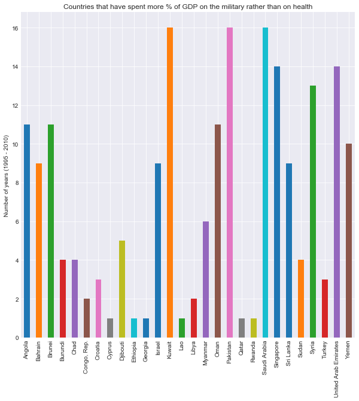
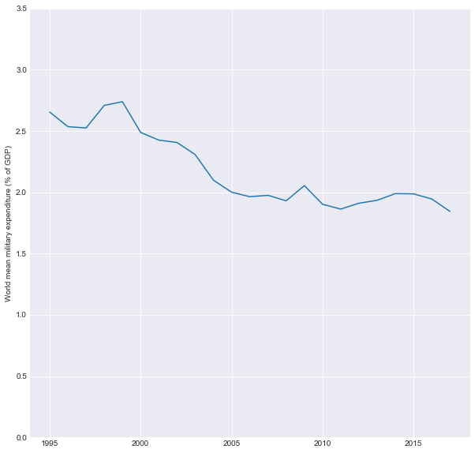

# Research Report: Investigating a Coherence Between Living Standard and Military Expenditures

## Table of Contents
<ul>
<li><a href="#intro">Introduction</a></li>
<li><a href="#wrangling">Data Wrangling</a></li>
<li><a href="#eda">Exploratory Data Analysis</a></li>
<li><a href="#conclusions">Conclusions</a></li>
<li><a href="#credits">Credits</a></li>
</ul>

<a id='intro'></a>
## Introduction

In this project, we will investigate some data from Gapminder - an independent Swedish foundation with no political, religious or economic affiliations. 

We will work with the following data files to look for the possible trends and correlations:

**1. Military expenditure (% of GDP)**

> Military expenditures data from SIPRI are derived from the NATO definition, which includes all current and capital expenditures on the armed forces, including peacekeeping forces; defense ministries and other government agencies engaged in defense projects; paramilitary forces, if these are judged to be trained and equipped for military operations; and military space activities. Such expenditures include military and civil personnel, including retirement pensions of military personnel and social services for personnel; operation and maintenance; procurement; military research and development; and military aid (in the military expenditures of the donor country). Excluded are civil defense and current expenditures for previous military activities, such as for veterans' benefits, demobilization, conversion, and destruction of weapons. This definition cannot be applied for all countries, however, since that would require much more detailed information than is available about what is included in military budgets and off-budget military expenditure items. 

**2. Income per person (GDP/capita, PPP$ inflation-adjusted)**

> Gross domestic product per person adjusted for differences in purchasing power (in international dollars, fixed 2011 prices, PPP based on 2011 ICP). © Gapminder based on World Bank, A. Maddison, M. Lindgren, IMF & more.

**3. Human Development Index (HDI)**

> Human Development Index is an index used to rank countries by level of "human development". It contains three dimensions: health level, educational level and living standard.


Image source: http://hdr.undp.org/

**4. Total health spending (% of GDP)**

> The sum of public and private health expenditure as a percentage of GDP.

Data source: https://www.gapminder.org/data/

## Research questions

1. A: Are higher / lower HDI countries spending more on health or on the military? B: Are all countries always spending more on health rather than on the military?

2. Is there a strong correlation between income per capita and military spending?

3. Is world spending more % of GDP on the military throughout the years?

4. Do countries with higher HDI spend larger % of GDP on health?

5. Did the distribution shape of personal income change throughout the years?


```python
# Prepare the workspace:

import numpy as np

import pandas as pd
from pandas.plotting import scatter_matrix

import matplotlib.pyplot as plt
from matplotlib.colors import rgb2hex, Normalize
% matplotlib inline

import warnings
import matplotlib.cbook
warnings.filterwarnings("ignore",category=matplotlib.cbook.mplDeprecation)
pd.set_option('mode.chained_assignment', None)

import seaborn as sns
sns.set_style('darkgrid')

from mpl_toolkits.basemap import Basemap
```

<a id='wrangling'></a>
## Data Wrangling

### General Properties


```python
# Explore the inicial data:

df_mil = pd.read_csv("military_expenditure_percent_of_gdp.csv") # "mil" for military
df_mil.name = "military_expenditure_percent_of_gdp"
df_inc = pd.read_csv("income_per_person_gdppercapita_ppp_inflation_adjusted.csv") # "inc" for income
df_inc.name = "income_per_person_gdppercapita_ppp"
df_hdi = pd.read_csv("hdi_human_development_index.csv") # "hdi" for human development index
df_hdi.name = "hdi_human_development_index"
df_hea = pd.read_csv("total_health_spending_percent_of_gdp.csv") # "hea" for health
df_hea.name = "total_health_spending_percent_of_gdp"

data_list = [df_mil, df_inc, df_hdi, df_hea]
for data in data_list:
    print(data.name)
    print(data.shape)
    print(data.head())
    print("\n")
```

    military_expenditure_percent_of_gdp
    (165, 59)
               geo  1960  1961  1962  1963  1964   1965   1966  1967  1968  ...    \
    0  Afghanistan   NaN   NaN   NaN   NaN   NaN    NaN    NaN   NaN   NaN  ...     
    1      Albania   NaN   NaN   NaN   NaN   NaN    NaN    NaN   NaN   NaN  ...     
    2      Algeria   NaN   NaN   NaN  2.46  3.43  3.360  3.440  2.94  2.58  ...     
    3       Angola   NaN   NaN   NaN   NaN   NaN    NaN    NaN   NaN   NaN  ...     
    4    Argentina  1.18  1.28  1.25  1.33  0.96  0.888  0.971  1.05  1.28  ...     
    
        2008   2009   2010   2011   2012   2013   2014   2015   2016   2017  
    0  2.330  2.060  1.900  1.780  1.140  1.050  1.300  0.993  0.955  0.916  
    1  1.980  1.520  1.560  1.530  1.490  1.410  1.350  1.160  1.100  1.250  
    2  3.020  3.850  3.520  4.330  4.460  4.840  5.550  6.270  6.420  5.910  
    3  3.760  4.390  4.240  3.500  3.640  4.880  5.400  3.520  2.960  2.470  
    4  0.763  0.887  0.815  0.764  0.785  0.838  0.878  0.850  0.813  0.891  
    
    [5 rows x 59 columns]
    
    
    income_per_person_gdppercapita_ppp
    (193, 220)
               geo  1800  1801  1802  1803  1804  1805  1806  1807  1808  ...    \
    0  Afghanistan   603   603   603   603   603   603   603   603   603  ...     
    1      Albania   667   667   667   667   667   668   668   668   668  ...     
    2      Algeria   715   716   717   718   719   720   721   722   723  ...     
    3      Andorra  1200  1200  1200  1200  1210  1210  1210  1210  1220  ...     
    4       Angola   618   620   623   626   628   631   634   637   640  ...     
    
        2009   2010   2011   2012   2013   2014   2015   2016   2017   2018  
    0   1530   1610   1660   1840   1810   1780   1750   1740   1800   1870  
    1   9530   9930  10200  10400  10500  10700  11000  11400  11900  12400  
    2  12600  12900  13000  13200  13300  13500  13700  14000  13800  13700  
    3  41700  39000  42000  41900  43700  44900  46600  48200  49800  51500  
    4   5910   5900   5910   6000   6190   6260   6230   6030   5940   5850  
    
    [5 rows x 220 columns]
    
    
    hdi_human_development_index
    (187, 27)
               geo   1990   1991   1992   1993   1994   1995   1996   1997   1998  \
    0  Afghanistan  0.295  0.300  0.309  0.305  0.300  0.324  0.328  0.332  0.335   
    1      Albania  0.635  0.618  0.603  0.608  0.616  0.628  0.637  0.636  0.646   
    2      Algeria  0.577  0.581  0.587  0.591  0.595  0.600  0.609  0.617  0.627   
    3      Andorra    NaN    NaN    NaN    NaN    NaN    NaN    NaN    NaN    NaN   
    4       Angola    NaN    NaN    NaN    NaN    NaN    NaN    NaN    NaN    NaN   
    
       ...     2006   2007   2008   2009   2010   2011   2012   2013   2014   2015  
    0  ...    0.415  0.433  0.434  0.448  0.454  0.463  0.470  0.476  0.479  0.479  
    1  ...    0.703  0.713  0.721  0.725  0.738  0.752  0.759  0.761  0.762  0.764  
    2  ...    0.690  0.697  0.705  0.714  0.724  0.732  0.737  0.741  0.743  0.745  
    3  ...      NaN    NaN    NaN    NaN  0.819  0.819  0.843  0.850  0.857  0.858  
    4  ...    0.454  0.468  0.480  0.488  0.495  0.508  0.523  0.527  0.531  0.533  
    
    [5 rows x 27 columns]
    
    
    total_health_spending_percent_of_gdp
    (190, 17)
               geo  1995  1996  1997  1998  1999  2000  2001  2002  2003  2004  \
    0  Afghanistan   NaN   NaN   NaN   NaN   NaN   NaN   NaN  5.72  6.82  6.36   
    1      Albania  2.56  4.04  4.81  5.34  5.83  6.35  6.04  6.28  6.16  6.88   
    2      Algeria  4.17  3.79  4.06  4.06  3.87  3.49  3.84  3.87  3.74  3.38   
    3      Andorra  7.64  8.03  8.03  9.85  7.35  7.58  6.79  7.04  7.12  7.11   
    4       Angola  3.79  2.17  2.26  1.85  1.94  2.41  3.45  2.36  2.64  2.09   
    
       2005  2006  2007  2008  2009  2010  
    0  6.63  6.77  7.30  6.98  7.58  7.58  
    1  6.84  6.73  6.88  6.75  6.88  6.55  
    2  3.06  3.13  3.53  3.73  4.58  4.17  
    3  7.22  7.44  7.55  7.54  7.52  7.52  
    4  1.96  2.42  2.52  3.19  4.95  2.85  
    
    
    

### Data Cleaning 

###### Step 1. Reshape data to a {Country, Year, Indicator Value} format:


```python
# Reshape data to a {Country, Year, Indicator Value} format:

reshape = lambda data: pd.melt(data, id_vars='geo', value_name=data.name, var_name='year')
```


```python
df_mil = reshape(df_mil)
df_inc = reshape(df_inc)
df_hdi = reshape(df_hdi)
df_hea = reshape(df_hea)
```


```python
# Check if the functions worked out as expected

# Update the list, otherwise old values will be printed:
data_list = [df_mil, df_inc, df_hdi, df_hea]

for data in data_list:
    print(data.shape)
    print(data.iloc[[0,1,-1]])
    print("\n")
```

    (9570, 3)
                  geo  year  military_expenditure_percent_of_gdp
    0     Afghanistan  1960                                  NaN
    1         Albania  1960                                  NaN
    9569     Zimbabwe  2017                                 1.91
    
    
    (42267, 3)
                   geo  year  income_per_person_gdppercapita_ppp
    0      Afghanistan  1800                                 603
    1          Albania  1800                                 667
    42266     Zimbabwe  2018                                1950
    
    
    (4862, 3)
                  geo  year  hdi_human_development_index
    0     Afghanistan  1990                        0.295
    1         Albania  1990                        0.635
    4861     Zimbabwe  2015                        0.516
    
    
    (3040, 3)
                  geo  year  total_health_spending_percent_of_gdp
    0     Afghanistan  1995                                   NaN
    1         Albania  1995                                  2.56
    3039     Zimbabwe  2010                                   NaN
    
    
    

###### Step 2. Drop all values before the year 1995 for a data consistency


```python
# Drop all values before the year 1995 for a data consistency:

drop_oldies = lambda data: data.query('year >= "1995"')
```


```python
df_mil = drop_oldies(df_mil)
df_inc = drop_oldies(df_inc)
df_hdi = drop_oldies(df_hdi)
df_hea = drop_oldies(df_hea)
```


```python
# Check if the functions worked out as expected

# Update the list, otherwise old values will be printed:
data_list = [df_mil, df_inc, df_hdi, df_hea]

for data in data_list:
    print(data.shape)
    print(data.iloc[[0,1,-1]])
    print("\n")
```

    (3795, 3)
                  geo  year  military_expenditure_percent_of_gdp
    5775  Afghanistan  1995                                  NaN
    5776      Albania  1995                                 2.10
    9569     Zimbabwe  2017                                 1.91
    
    
    (4632, 3)
                   geo  year  income_per_person_gdppercapita_ppp
    37635  Afghanistan  1995                                 881
    37636      Albania  1995                                4130
    42266     Zimbabwe  2018                                1950
    
    
    (3927, 3)
                  geo  year  hdi_human_development_index
    935   Afghanistan  1995                        0.324
    936       Albania  1995                        0.628
    4861     Zimbabwe  2015                        0.516
    
    
    (3040, 3)
                  geo  year  total_health_spending_percent_of_gdp
    0     Afghanistan  1995                                   NaN
    1         Albania  1995                                  2.56
    3039     Zimbabwe  2010                                   NaN
    
    
    

###### Step 3. Combine all data frames into one by the "geo" and "year" columns

Note that "income_per_person_gdppercapita_ppp_inflation_adjusted" data frame has widest year range and largest row count. We will merge data frames with LEFT JOIN starting from largest to smallest, _to include maximums years in the final data_.


```python
# Combine all data frames into one by the "geo" and "year" columns:

df = df_inc.merge(df_hdi, how='left', on=['geo', 'year']).merge(df_mil, how='left', on=['geo', 'year']).merge(df_hea, how='left', on=['geo', 'year'])

print(df.shape)
df.tail()
```

    (4632, 6)
    


<div>
<style scoped>
    .dataframe tbody tr th:only-of-type {
        vertical-align: middle;
    }

    .dataframe tbody tr th {
        vertical-align: top;
    }

    .dataframe thead th {
        text-align: right;
    }
</style>
<table border="1" class="dataframe">
  <thead>
    <tr style="text-align: right;">
      <th></th>
      <th>geo</th>
      <th>year</th>
      <th>income_per_person_gdppercapita_ppp</th>
      <th>hdi_human_development_index</th>
      <th>military_expenditure_percent_of_gdp</th>
      <th>total_health_spending_percent_of_gdp</th>
    </tr>
  </thead>
  <tbody>
    <tr>
      <th>4627</th>
      <td>Venezuela</td>
      <td>2018</td>
      <td>14200</td>
      <td>NaN</td>
      <td>NaN</td>
      <td>NaN</td>
    </tr>
    <tr>
      <th>4628</th>
      <td>Vietnam</td>
      <td>2018</td>
      <td>6550</td>
      <td>NaN</td>
      <td>NaN</td>
      <td>NaN</td>
    </tr>
    <tr>
      <th>4629</th>
      <td>Yemen</td>
      <td>2018</td>
      <td>2430</td>
      <td>NaN</td>
      <td>NaN</td>
      <td>NaN</td>
    </tr>
    <tr>
      <th>4630</th>
      <td>Zambia</td>
      <td>2018</td>
      <td>3870</td>
      <td>NaN</td>
      <td>NaN</td>
      <td>NaN</td>
    </tr>
    <tr>
      <th>4631</th>
      <td>Zimbabwe</td>
      <td>2018</td>
      <td>1950</td>
      <td>NaN</td>
      <td>NaN</td>
      <td>NaN</td>
    </tr>
  </tbody>
</table>
</div>


###### Step 4. Check for duplicates


```python
sum(df.duplicated())
```


    0


###### Step 5. Check for null values


```python
df.isnull().sum()
```


    geo                                        0
    year                                       0
    income_per_person_gdppercapita_ppp         0
    hdi_human_development_index             1041
    military_expenditure_percent_of_gdp     1208
    total_health_spending_percent_of_gdp    1624
    dtype: int64


Note that we don't drop these values for now to avoid unnecessary data loss. They **will be dropped later** in the data analysis part!

###### Step 6. Use shorter column names to improve data readability


```python
# Use shorter column names to improve data readability:

names = ['geo', 'year', 'gdp_per_capita', 'hdi', 'military_of_gdp', 'health_of_gdp']
df.columns = names
df.head()
```


<div>
<style scoped>
    .dataframe tbody tr th:only-of-type {
        vertical-align: middle;
    }

    .dataframe tbody tr th {
        vertical-align: top;
    }

    .dataframe thead th {
        text-align: right;
    }
</style>
<table border="1" class="dataframe">
  <thead>
    <tr style="text-align: right;">
      <th></th>
      <th>geo</th>
      <th>year</th>
      <th>gdp_per_capita</th>
      <th>hdi</th>
      <th>military_of_gdp</th>
      <th>health_of_gdp</th>
    </tr>
  </thead>
  <tbody>
    <tr>
      <th>0</th>
      <td>Afghanistan</td>
      <td>1995</td>
      <td>881</td>
      <td>0.324</td>
      <td>NaN</td>
      <td>NaN</td>
    </tr>
    <tr>
      <th>1</th>
      <td>Albania</td>
      <td>1995</td>
      <td>4130</td>
      <td>0.628</td>
      <td>2.10</td>
      <td>2.56</td>
    </tr>
    <tr>
      <th>2</th>
      <td>Algeria</td>
      <td>1995</td>
      <td>9300</td>
      <td>0.600</td>
      <td>2.96</td>
      <td>4.17</td>
    </tr>
    <tr>
      <th>3</th>
      <td>Andorra</td>
      <td>1995</td>
      <td>26100</td>
      <td>NaN</td>
      <td>NaN</td>
      <td>7.64</td>
    </tr>
    <tr>
      <th>4</th>
      <td>Angola</td>
      <td>1995</td>
      <td>2970</td>
      <td>NaN</td>
      <td>4.28</td>
      <td>3.79</td>
    </tr>
  </tbody>
</table>
</div>


###### Step 7. Check and correct data types if necessary


```python
df.dtypes
```


    geo                 object
    year                object
    gdp_per_capita       int64
    hdi                float64
    military_of_gdp    float64
    health_of_gdp      float64
    dtype: object


```python
# Convert "year" column from string type to int (also could be datetime object, but we don't need it for now):

df.year = df.year.astype(int)
```


```python
df.dtypes
```


    geo                 object
    year                 int32
    gdp_per_capita       int64
    hdi                float64
    military_of_gdp    float64
    health_of_gdp      float64
    dtype: object


###### Step 8. Pre-explore the data with a matrix of scatter plots


```python
# Pre-explore the data (without null values) with a matrix of scatter plots:
scatter_matrix(df.dropna(), figsize=(10,10))
plt.show()
```


<a id='eda'></a>
## Exploratory Data Analysis

### Research Question 1A: Are higher / lower HDI countries spending more on health or on the military?


```python
# Drop nulls from the data we will work with on this particular question, this way we will keep the maximum amount of data:

df_q1 = df[['geo', 'year', 'hdi', 'military_of_gdp', 'health_of_gdp']].dropna()
df_q1.iloc[[0,1,-1]]
```


<div>
<style scoped>
    .dataframe tbody tr th:only-of-type {
        vertical-align: middle;
    }

    .dataframe tbody tr th {
        vertical-align: top;
    }

    .dataframe thead th {
        text-align: right;
    }
</style>
<table border="1" class="dataframe">
  <thead>
    <tr style="text-align: right;">
      <th></th>
      <th>geo</th>
      <th>year</th>
      <th>hdi</th>
      <th>military_of_gdp</th>
      <th>health_of_gdp</th>
    </tr>
  </thead>
  <tbody>
    <tr>
      <th>1</th>
      <td>Albania</td>
      <td>1995</td>
      <td>0.628</td>
      <td>2.10</td>
      <td>2.56</td>
    </tr>
    <tr>
      <th>2</th>
      <td>Algeria</td>
      <td>1995</td>
      <td>0.600</td>
      <td>2.96</td>
      <td>4.17</td>
    </tr>
    <tr>
      <th>3086</th>
      <td>Zambia</td>
      <td>2010</td>
      <td>0.543</td>
      <td>1.38</td>
      <td>5.89</td>
    </tr>
  </tbody>
</table>
</div>


```python
# See descriptive statistics for HDI, to further define the bin edges:

df_q1['hdi'].describe()
```


    count    2249.000000
    mean        0.654481
    std         0.169743
    min         0.230000
    25%         0.519000
    50%         0.684000
    75%         0.792000
    max         0.939000
    Name: hdi, dtype: float64


```python
# Divide HDI by 3 categories (Q1, IQR, Q4) and add a new column with these categories' names:

df_q1['hdi_category'] = pd.cut(df_q1['hdi'], [0.23,0.519,0.792,0.939], labels=['low', 'medium', 'high'])
df_q1.iloc[[0,1,-1]]
```


<div>
<style scoped>
    .dataframe tbody tr th:only-of-type {
        vertical-align: middle;
    }

    .dataframe tbody tr th {
        vertical-align: top;
    }

    .dataframe thead th {
        text-align: right;
    }
</style>
<table border="1" class="dataframe">
  <thead>
    <tr style="text-align: right;">
      <th></th>
      <th>geo</th>
      <th>year</th>
      <th>hdi</th>
      <th>military_of_gdp</th>
      <th>health_of_gdp</th>
      <th>hdi_category</th>
    </tr>
  </thead>
  <tbody>
    <tr>
      <th>1</th>
      <td>Albania</td>
      <td>1995</td>
      <td>0.628</td>
      <td>2.10</td>
      <td>2.56</td>
      <td>medium</td>
    </tr>
    <tr>
      <th>2</th>
      <td>Algeria</td>
      <td>1995</td>
      <td>0.600</td>
      <td>2.96</td>
      <td>4.17</td>
      <td>medium</td>
    </tr>
    <tr>
      <th>3086</th>
      <td>Zambia</td>
      <td>2010</td>
      <td>0.543</td>
      <td>1.38</td>
      <td>5.89</td>
      <td>medium</td>
    </tr>
  </tbody>
</table>
</div>


```python
# Group by 'hdi_category' and compare the mean values of spending % of GDP:

data = df_q1.groupby(['hdi_category'])['military_of_gdp', 'health_of_gdp', ].mean()
data
```


<div>
<style scoped>
    .dataframe tbody tr th:only-of-type {
        vertical-align: middle;
    }

    .dataframe tbody tr th {
        vertical-align: top;
    }

    .dataframe thead th {
        text-align: right;
    }
</style>
<table border="1" class="dataframe">
  <thead>
    <tr style="text-align: right;">
      <th></th>
      <th>military_of_gdp</th>
      <th>health_of_gdp</th>
    </tr>
    <tr>
      <th>hdi_category</th>
      <th></th>
      <th></th>
    </tr>
  </thead>
  <tbody>
    <tr>
      <th>low</th>
      <td>2.145219</td>
      <td>5.507918</td>
    </tr>
    <tr>
      <th>medium</th>
      <td>2.243483</td>
      <td>5.800204</td>
    </tr>
    <tr>
      <th>high</th>
      <td>2.045877</td>
      <td>7.975993</td>
    </tr>
  </tbody>
</table>
</div>


```python
data.plot(kind="bar", figsize=(10,10))

plt.title('Military expenditure vs. Total health spending (% of GDP) 1995 - 2010')

plt.xlabel('')
plt.ylabel('% of GDP')
plt.legend(["Military", "Health"]);

columns = ['Low HDI (Q1)', 'Medium HDI (IQR)', 'High HDI (Q4)']
plt.xticks(range(len(columns)), columns)

plt.show()
```


Note than same country can fall into the different HDI category depending on the year. Here we focus more on HDI vs. spending % of GDP correlation, not on a country list.

### Research Question 1B: Are all countries always spending more on health rather than on the military?


```python
# Let's check if there is any country that spent more on the military than on the health:
df_q2 = df.query('military_of_gdp > health_of_gdp').dropna() # drop nulls from the data we will work with
df_q2.iloc[[0,1,-1]]
```


<div>
<style scoped>
    .dataframe tbody tr th:only-of-type {
        vertical-align: middle;
    }

    .dataframe tbody tr th {
        vertical-align: top;
    }

    .dataframe thead th {
        text-align: right;
    }
</style>
<table border="1" class="dataframe">
  <thead>
    <tr style="text-align: right;">
      <th></th>
      <th>geo</th>
      <th>year</th>
      <th>gdp_per_capita</th>
      <th>hdi</th>
      <th>military_of_gdp</th>
      <th>health_of_gdp</th>
    </tr>
  </thead>
  <tbody>
    <tr>
      <th>12</th>
      <td>Bahrain</td>
      <td>1995</td>
      <td>43500</td>
      <td>0.775</td>
      <td>5.18</td>
      <td>4.58</td>
    </tr>
    <tr>
      <th>24</th>
      <td>Brunei</td>
      <td>1995</td>
      <td>86100</td>
      <td>0.805</td>
      <td>6.04</td>
      <td>2.67</td>
    </tr>
    <tr>
      <th>3077</th>
      <td>United Arab Emirates</td>
      <td>2010</td>
      <td>57600</td>
      <td>0.824</td>
      <td>6.04</td>
      <td>3.66</td>
    </tr>
  </tbody>
</table>
</div>


```python
# Check how many years each of resulting countries have spent more on the military:
data = df_q2.groupby(['geo']).size()
data
```


    geo
    Angola                  11
    Bahrain                  9
    Brunei                  11
    Burundi                  4
    Chad                     4
    Congo, Rep.              2
    Croatia                  3
    Cyprus                   1
    Djibouti                 5
    Ethiopia                 1
    Georgia                  1
    Israel                   9
    Kuwait                  16
    Lao                      1
    Libya                    2
    Myanmar                  6
    Oman                    11
    Pakistan                16
    Qatar                    1
    Rwanda                   1
    Saudi Arabia            16
    Singapore               14
    Sri Lanka                9
    Sudan                    4
    Syria                   13
    Turkey                   3
    United Arab Emirates    14
    Yemen                   10
    dtype: int64


```python
data.plot(kind="bar", figsize=(10,10))

plt.title('Countries that have spent more % of GDP on the military rather than on health')

plt.xlabel('')
plt.ylabel('Number of years (1995 - 2010)')

plt.show()
```





### Research Question 2: Is there a strong correlation between income per capita and military spendings?


```python
# Drop nulls from the data we will work with on this particular question, this way we will keep the maximum amount of data:

df_q3 = df[['geo', 'year', 'gdp_per_capita', 'military_of_gdp']].dropna()
df_q3.iloc[[0,1,-1]]
```


<div>
<style scoped>
    .dataframe tbody tr th:only-of-type {
        vertical-align: middle;
    }

    .dataframe tbody tr th {
        vertical-align: top;
    }

    .dataframe thead th {
        text-align: right;
    }
</style>
<table border="1" class="dataframe">
  <thead>
    <tr style="text-align: right;">
      <th></th>
      <th>geo</th>
      <th>year</th>
      <th>gdp_per_capita</th>
      <th>military_of_gdp</th>
    </tr>
  </thead>
  <tbody>
    <tr>
      <th>1</th>
      <td>Albania</td>
      <td>1995</td>
      <td>4130</td>
      <td>2.10</td>
    </tr>
    <tr>
      <th>2</th>
      <td>Algeria</td>
      <td>1995</td>
      <td>9300</td>
      <td>2.96</td>
    </tr>
    <tr>
      <th>4438</th>
      <td>Zimbabwe</td>
      <td>2017</td>
      <td>1910</td>
      <td>1.91</td>
    </tr>
  </tbody>
</table>
</div>


```python
data = df_q3.groupby(['geo'])['gdp_per_capita', 'military_of_gdp'].mean()
```


```python
fig, ax = plt.subplots()
ax.scatter(data['gdp_per_capita'], data['military_of_gdp'])

ax.grid(True)
fig.tight_layout()

plt.show()
```


```python
data['gdp_per_capita'].corr(data['military_of_gdp'])
```


    0.0751691172157713


The correlation coefficient is close to zero, so there is no linear relationship here.

### Research Question 3: Is world spending more % of GDP on the military throughout the years?


```python
data = df.groupby(['year'])['military_of_gdp'].mean()
data
```


    year
    1995    2.654972
    1996    2.535867
    1997    2.524861
    1998    2.708878
    1999    2.739326
    2000    2.488559
    2001    2.425678
    2002    2.406470
    2003    2.307545
    2004    2.099148
    2005    2.000968
    2006    1.964351
    2007    1.975242
    2008    1.930699
    2009    2.054591
    2010    1.902473
    2011    1.863102
    2012    1.911000
    2013    1.934876
    2014    1.989246
    2015    1.987397
    2016    1.945786
    2017    1.844346
    2018         NaN
    Name: military_of_gdp, dtype: float64


```python
fig = plt.figure(figsize=(10,10))
ax = plt.axes()

ax.plot(data)
ax.set_ylim(ymin=0, ymax=3.5)
plt.ylabel('World mean military expenditure (% of GDP)')
plt.show()
```





### Research Question 4: Do countries with higher HDI spend larger % of GDP on heath?

### Preparing the geo data


```python
# To create a map, we would need a latitude and longitude for each country:

df_geo = pd.io.parsers.read_csv("https://opendata.socrata.com/api/views/mnkm-8ram/rows.csv?accessType=DOWNLOAD") 
df_geo.head()
```


<div>
<style scoped>
    .dataframe tbody tr th:only-of-type {
        vertical-align: middle;
    }

    .dataframe tbody tr th {
        vertical-align: top;
    }

    .dataframe thead th {
        text-align: right;
    }
</style>
<table border="1" class="dataframe">
  <thead>
    <tr style="text-align: right;">
      <th></th>
      <th>Country</th>
      <th>Alpha-2 code</th>
      <th>Alpha-3 code</th>
      <th>Numeric code</th>
      <th>Latitude (average)</th>
      <th>Longitude (average)</th>
      <th>Icon</th>
    </tr>
  </thead>
  <tbody>
    <tr>
      <th>0</th>
      <td>Albania</td>
      <td>AL</td>
      <td>ALB</td>
      <td>8</td>
      <td>41.0000</td>
      <td>20.0</td>
      <td>NaN</td>
    </tr>
    <tr>
      <th>1</th>
      <td>Algeria</td>
      <td>DZ</td>
      <td>DZA</td>
      <td>12</td>
      <td>28.0000</td>
      <td>3.0</td>
      <td>NaN</td>
    </tr>
    <tr>
      <th>2</th>
      <td>American Samoa</td>
      <td>AS</td>
      <td>ASM</td>
      <td>16</td>
      <td>-14.3333</td>
      <td>-170.0</td>
      <td>NaN</td>
    </tr>
    <tr>
      <th>3</th>
      <td>Andorra</td>
      <td>AD</td>
      <td>AND</td>
      <td>20</td>
      <td>42.5000</td>
      <td>1.6</td>
      <td>NaN</td>
    </tr>
    <tr>
      <th>4</th>
      <td>Angola</td>
      <td>AO</td>
      <td>AGO</td>
      <td>24</td>
      <td>-12.5000</td>
      <td>18.5</td>
      <td>NaN</td>
    </tr>
  </tbody>
</table>
</div>


```python
# Cut off unnecessary columns and prepare names for joining:

df_geo.rename(columns={"Country": "geo"}, inplace=True)
df_geo = df_geo[['geo', 'Latitude (average)', 'Longitude (average)']]
df_geo.head()
```


<div>
<style scoped>
    .dataframe tbody tr th:only-of-type {
        vertical-align: middle;
    }

    .dataframe tbody tr th {
        vertical-align: top;
    }

    .dataframe thead th {
        text-align: right;
    }
</style>
<table border="1" class="dataframe">
  <thead>
    <tr style="text-align: right;">
      <th></th>
      <th>geo</th>
      <th>Latitude (average)</th>
      <th>Longitude (average)</th>
    </tr>
  </thead>
  <tbody>
    <tr>
      <th>0</th>
      <td>Albania</td>
      <td>41.0000</td>
      <td>20.0</td>
    </tr>
    <tr>
      <th>1</th>
      <td>Algeria</td>
      <td>28.0000</td>
      <td>3.0</td>
    </tr>
    <tr>
      <th>2</th>
      <td>American Samoa</td>
      <td>-14.3333</td>
      <td>-170.0</td>
    </tr>
    <tr>
      <th>3</th>
      <td>Andorra</td>
      <td>42.5000</td>
      <td>1.6</td>
    </tr>
    <tr>
      <th>4</th>
      <td>Angola</td>
      <td>-12.5000</td>
      <td>18.5</td>
    </tr>
  </tbody>
</table>
</div>


```python
# Add latitude and longitude to our data set:

df_geo = df.merge(df_geo, how='left', on=['geo'])
df_geo.head()
```


<div>
<style scoped>
    .dataframe tbody tr th:only-of-type {
        vertical-align: middle;
    }

    .dataframe tbody tr th {
        vertical-align: top;
    }

    .dataframe thead th {
        text-align: right;
    }
</style>
<table border="1" class="dataframe">
  <thead>
    <tr style="text-align: right;">
      <th></th>
      <th>geo</th>
      <th>year</th>
      <th>gdp_per_capita</th>
      <th>hdi</th>
      <th>military_of_gdp</th>
      <th>health_of_gdp</th>
      <th>Latitude (average)</th>
      <th>Longitude (average)</th>
    </tr>
  </thead>
  <tbody>
    <tr>
      <th>0</th>
      <td>Afghanistan</td>
      <td>1995</td>
      <td>881</td>
      <td>0.324</td>
      <td>NaN</td>
      <td>NaN</td>
      <td>33.0</td>
      <td>65.0</td>
    </tr>
    <tr>
      <th>1</th>
      <td>Albania</td>
      <td>1995</td>
      <td>4130</td>
      <td>0.628</td>
      <td>2.10</td>
      <td>2.56</td>
      <td>41.0</td>
      <td>20.0</td>
    </tr>
    <tr>
      <th>2</th>
      <td>Algeria</td>
      <td>1995</td>
      <td>9300</td>
      <td>0.600</td>
      <td>2.96</td>
      <td>4.17</td>
      <td>28.0</td>
      <td>3.0</td>
    </tr>
    <tr>
      <th>3</th>
      <td>Andorra</td>
      <td>1995</td>
      <td>26100</td>
      <td>NaN</td>
      <td>NaN</td>
      <td>7.64</td>
      <td>42.5</td>
      <td>1.6</td>
    </tr>
    <tr>
      <th>4</th>
      <td>Angola</td>
      <td>1995</td>
      <td>2970</td>
      <td>NaN</td>
      <td>4.28</td>
      <td>3.79</td>
      <td>-12.5</td>
      <td>18.5</td>
    </tr>
  </tbody>
</table>
</div>


```python
# Narrow down to EU countries

eu_list = ['Austria', 'Belgium', 'Bulgaria', 'Croatia', 'Cyprus', 'Czech Republic', 'Denmark', 'Estonia', 'Finland', 'France', 'Germany', 'Greece', 'Hungary', 'Ireland', 'Italy', 'Latvia', 'Lithuania', 'Luxembourg', 'Malta', 'Netherlands', 'Poland', 'Portugal', 'Romania', 'Slovakia', 'Slovenia', 'Spain', 'Sweden', 'United Kingdom']

df_eu = df_geo.query('geo in @eu_list')
df_eu.head()
```


<div>
<style scoped>
    .dataframe tbody tr th:only-of-type {
        vertical-align: middle;
    }

    .dataframe tbody tr th {
        vertical-align: top;
    }

    .dataframe thead th {
        text-align: right;
    }
</style>
<table border="1" class="dataframe">
  <thead>
    <tr style="text-align: right;">
      <th></th>
      <th>geo</th>
      <th>year</th>
      <th>gdp_per_capita</th>
      <th>hdi</th>
      <th>military_of_gdp</th>
      <th>health_of_gdp</th>
      <th>Latitude (average)</th>
      <th>Longitude (average)</th>
    </tr>
  </thead>
  <tbody>
    <tr>
      <th>9</th>
      <td>Austria</td>
      <td>1995</td>
      <td>33700</td>
      <td>0.816</td>
      <td>1.06</td>
      <td>9.52</td>
      <td>47.3333</td>
      <td>13.3333</td>
    </tr>
    <tr>
      <th>16</th>
      <td>Belgium</td>
      <td>1995</td>
      <td>32700</td>
      <td>0.851</td>
      <td>1.54</td>
      <td>7.61</td>
      <td>50.8333</td>
      <td>4.0000</td>
    </tr>
    <tr>
      <th>25</th>
      <td>Bulgaria</td>
      <td>1995</td>
      <td>8450</td>
      <td>0.702</td>
      <td>2.38</td>
      <td>5.24</td>
      <td>43.0000</td>
      <td>25.0000</td>
    </tr>
    <tr>
      <th>42</th>
      <td>Croatia</td>
      <td>1995</td>
      <td>12600</td>
      <td>0.695</td>
      <td>9.20</td>
      <td>6.85</td>
      <td>45.1667</td>
      <td>15.5000</td>
    </tr>
    <tr>
      <th>44</th>
      <td>Cyprus</td>
      <td>1995</td>
      <td>26500</td>
      <td>0.784</td>
      <td>3.04</td>
      <td>4.74</td>
      <td>35.0000</td>
      <td>33.0000</td>
    </tr>
  </tbody>
</table>
</div>


Check if we collected all countries by comparing the counts:


```python
print (df_eu['geo'].nunique())
print (len(eu_list))
```

    27
    28
    

Something is not right here. Let's see which countries we do have:


```python
df_eu.groupby(['geo']).mean()
```


<div>
<style scoped>
    .dataframe tbody tr th:only-of-type {
        vertical-align: middle;
    }

    .dataframe tbody tr th {
        vertical-align: top;
    }

    .dataframe thead th {
        text-align: right;
    }
</style>
<table border="1" class="dataframe">
  <thead>
    <tr style="text-align: right;">
      <th></th>
      <th>year</th>
      <th>gdp_per_capita</th>
      <th>hdi</th>
      <th>military_of_gdp</th>
      <th>health_of_gdp</th>
      <th>Latitude (average)</th>
      <th>Longitude (average)</th>
    </tr>
    <tr>
      <th>geo</th>
      <th></th>
      <th></th>
      <th></th>
      <th></th>
      <th></th>
      <th></th>
      <th></th>
    </tr>
  </thead>
  <tbody>
    <tr>
      <th>Austria</th>
      <td>2006.5</td>
      <td>41108.333333</td>
      <td>0.856286</td>
      <td>0.866783</td>
      <td>10.143125</td>
      <td>47.3333</td>
      <td>13.3333</td>
    </tr>
    <tr>
      <th>Belgium</th>
      <td>2006.5</td>
      <td>39150.000000</td>
      <td>0.874905</td>
      <td>1.173522</td>
      <td>9.059375</td>
      <td>50.8333</td>
      <td>4.0000</td>
    </tr>
    <tr>
      <th>Bulgaria</th>
      <td>2006.5</td>
      <td>13228.333333</td>
      <td>0.746905</td>
      <td>2.077826</td>
      <td>6.528750</td>
      <td>43.0000</td>
      <td>25.0000</td>
    </tr>
    <tr>
      <th>Croatia</th>
      <td>2006.5</td>
      <td>18695.833333</td>
      <td>0.776333</td>
      <td>2.983913</td>
      <td>7.002500</td>
      <td>45.1667</td>
      <td>15.5000</td>
    </tr>
    <tr>
      <th>Cyprus</th>
      <td>2006.5</td>
      <td>31304.166667</td>
      <td>0.826000</td>
      <td>2.387391</td>
      <td>5.900625</td>
      <td>35.0000</td>
      <td>33.0000</td>
    </tr>
    <tr>
      <th>Czech Republic</th>
      <td>2006.5</td>
      <td>25808.333333</td>
      <td>0.840143</td>
      <td>1.453739</td>
      <td>6.791250</td>
      <td>49.7500</td>
      <td>15.5000</td>
    </tr>
    <tr>
      <th>Denmark</th>
      <td>2006.5</td>
      <td>43408.333333</td>
      <td>0.889476</td>
      <td>1.396087</td>
      <td>9.408750</td>
      <td>56.0000</td>
      <td>10.0000</td>
    </tr>
    <tr>
      <th>Estonia</th>
      <td>2006.5</td>
      <td>21633.333333</td>
      <td>0.809381</td>
      <td>1.682261</td>
      <td>5.848125</td>
      <td>59.0000</td>
      <td>26.0000</td>
    </tr>
    <tr>
      <th>Finland</th>
      <td>2006.5</td>
      <td>37250.000000</td>
      <td>0.865143</td>
      <td>1.419130</td>
      <td>8.015625</td>
      <td>64.0000</td>
      <td>26.0000</td>
    </tr>
    <tr>
      <th>France</th>
      <td>2006.5</td>
      <td>35979.166667</td>
      <td>0.864476</td>
      <td>2.445652</td>
      <td>10.793750</td>
      <td>46.0000</td>
      <td>2.0000</td>
    </tr>
    <tr>
      <th>Germany</th>
      <td>2006.5</td>
      <td>39400.000000</td>
      <td>0.886048</td>
      <td>1.350435</td>
      <td>10.662500</td>
      <td>51.0000</td>
      <td>9.0000</td>
    </tr>
    <tr>
      <th>Greece</th>
      <td>2006.5</td>
      <td>26187.500000</td>
      <td>0.831810</td>
      <td>2.843478</td>
      <td>9.136875</td>
      <td>39.0000</td>
      <td>22.0000</td>
    </tr>
    <tr>
      <th>Hungary</th>
      <td>2006.5</td>
      <td>21241.666667</td>
      <td>0.794857</td>
      <td>1.244000</td>
      <td>7.522500</td>
      <td>47.0000</td>
      <td>20.0000</td>
    </tr>
    <tr>
      <th>Ireland</th>
      <td>2006.5</td>
      <td>46116.666667</td>
      <td>0.877667</td>
      <td>0.609870</td>
      <td>7.256875</td>
      <td>53.0000</td>
      <td>-8.0000</td>
    </tr>
    <tr>
      <th>Italy</th>
      <td>2006.5</td>
      <td>35795.833333</td>
      <td>0.850000</td>
      <td>1.728261</td>
      <td>8.341250</td>
      <td>42.8333</td>
      <td>12.8333</td>
    </tr>
    <tr>
      <th>Latvia</th>
      <td>2006.5</td>
      <td>17156.250000</td>
      <td>0.774381</td>
      <td>1.178174</td>
      <td>6.355625</td>
      <td>57.0000</td>
      <td>25.0000</td>
    </tr>
    <tr>
      <th>Lithuania</th>
      <td>2006.5</td>
      <td>19361.250000</td>
      <td>0.791810</td>
      <td>1.050348</td>
      <td>6.230000</td>
      <td>56.0000</td>
      <td>24.0000</td>
    </tr>
    <tr>
      <th>Luxembourg</th>
      <td>2006.5</td>
      <td>86612.500000</td>
      <td>0.868238</td>
      <td>0.564217</td>
      <td>7.038750</td>
      <td>49.7500</td>
      <td>6.1667</td>
    </tr>
    <tr>
      <th>Malta</th>
      <td>2006.5</td>
      <td>27591.666667</td>
      <td>0.804667</td>
      <td>0.651696</td>
      <td>7.737500</td>
      <td>35.8333</td>
      <td>14.5833</td>
    </tr>
    <tr>
      <th>Netherlands</th>
      <td>2006.5</td>
      <td>43437.500000</td>
      <td>0.894571</td>
      <td>1.405217</td>
      <td>9.283125</td>
      <td>52.5000</td>
      <td>5.7500</td>
    </tr>
    <tr>
      <th>Poland</th>
      <td>2006.5</td>
      <td>19108.333333</td>
      <td>0.803667</td>
      <td>1.898696</td>
      <td>6.214375</td>
      <td>52.0000</td>
      <td>20.0000</td>
    </tr>
    <tr>
      <th>Portugal</th>
      <td>2006.5</td>
      <td>26016.666667</td>
      <td>0.799952</td>
      <td>1.934348</td>
      <td>9.305000</td>
      <td>39.5000</td>
      <td>-8.0000</td>
    </tr>
    <tr>
      <th>Romania</th>
      <td>2006.5</td>
      <td>15795.833333</td>
      <td>0.751238</td>
      <td>1.914348</td>
      <td>5.075625</td>
      <td>46.0000</td>
      <td>25.0000</td>
    </tr>
    <tr>
      <th>Slovenia</th>
      <td>2006.5</td>
      <td>26187.500000</td>
      <td>0.848952</td>
      <td>1.312043</td>
      <td>8.275000</td>
      <td>46.0000</td>
      <td>15.0000</td>
    </tr>
    <tr>
      <th>Spain</th>
      <td>2006.5</td>
      <td>31220.833333</td>
      <td>0.844048</td>
      <td>1.456087</td>
      <td>8.008750</td>
      <td>40.0000</td>
      <td>-4.0000</td>
    </tr>
    <tr>
      <th>Sweden</th>
      <td>2006.5</td>
      <td>40491.666667</td>
      <td>0.887952</td>
      <td>1.464783</td>
      <td>8.810625</td>
      <td>62.0000</td>
      <td>15.0000</td>
    </tr>
    <tr>
      <th>United Kingdom</th>
      <td>2006.5</td>
      <td>35466.666667</td>
      <td>0.881000</td>
      <td>2.193478</td>
      <td>7.800625</td>
      <td>54.0000</td>
      <td>-2.0000</td>
    </tr>
  </tbody>
</table>
</div>


No Slovakia...


```python
# Perhaps missing country was not included in the inicial data set?

df_test = df_geo.query('geo == "Slovakia"')
df_test.groupby(['geo']).mean()

# Yes, no such country here!
```


<div>
<style scoped>
    .dataframe tbody tr th:only-of-type {
        vertical-align: middle;
    }

    .dataframe tbody tr th {
        vertical-align: top;
    }

    .dataframe thead th {
        text-align: right;
    }
</style>
<table border="1" class="dataframe">
  <thead>
    <tr style="text-align: right;">
      <th></th>
      <th>year</th>
      <th>gdp_per_capita</th>
      <th>hdi</th>
      <th>military_of_gdp</th>
      <th>health_of_gdp</th>
      <th>Latitude (average)</th>
      <th>Longitude (average)</th>
    </tr>
    <tr>
      <th>geo</th>
      <th></th>
      <th></th>
      <th></th>
      <th></th>
      <th></th>
      <th></th>
      <th></th>
    </tr>
  </thead>
  <tbody>
  </tbody>
</table>
</div>


```python
# Let's check if the issue is name related:

df_test = df_geo.query('geo == "Slovak Republic"')
df_test.groupby(['geo']).mean()

# Yes, here we can confirm that correct name should be "Slovak Republic"!
```


<div>
<style scoped>
    .dataframe tbody tr th:only-of-type {
        vertical-align: middle;
    }

    .dataframe tbody tr th {
        vertical-align: top;
    }

    .dataframe thead th {
        text-align: right;
    }
</style>
<table border="1" class="dataframe">
  <thead>
    <tr style="text-align: right;">
      <th></th>
      <th>year</th>
      <th>gdp_per_capita</th>
      <th>hdi</th>
      <th>military_of_gdp</th>
      <th>health_of_gdp</th>
      <th>Latitude (average)</th>
      <th>Longitude (average)</th>
    </tr>
    <tr>
      <th>geo</th>
      <th></th>
      <th></th>
      <th></th>
      <th></th>
      <th></th>
      <th></th>
      <th></th>
    </tr>
  </thead>
  <tbody>
    <tr>
      <th>Slovak Republic</th>
      <td>2006.5</td>
      <td>21812.5</td>
      <td>0.79619</td>
      <td>1.611348</td>
      <td>6.714375</td>
      <td>NaN</td>
      <td>NaN</td>
    </tr>
  </tbody>
</table>
</div>


Update the data frame with correct info:


```python
# Update the data frame with correct info:

eu_list[eu_list.index("Slovakia")] = "Slovak Republic"
df_eu = df_geo.query('geo in @eu_list')

# Update latitude and longitude values for Slovak Republic:

df_eu.loc[df_eu['geo'] == "Slovak Republic", ['Latitude (average)','Longitude (average)']] = [48.669026, 19.699024]

# Check the result:
df_eu.groupby(['geo']).mean()

```


<div>
<style scoped>
    .dataframe tbody tr th:only-of-type {
        vertical-align: middle;
    }

    .dataframe tbody tr th {
        vertical-align: top;
    }

    .dataframe thead th {
        text-align: right;
    }
</style>
<table border="1" class="dataframe">
  <thead>
    <tr style="text-align: right;">
      <th></th>
      <th>year</th>
      <th>gdp_per_capita</th>
      <th>hdi</th>
      <th>military_of_gdp</th>
      <th>health_of_gdp</th>
      <th>Latitude (average)</th>
      <th>Longitude (average)</th>
    </tr>
    <tr>
      <th>geo</th>
      <th></th>
      <th></th>
      <th></th>
      <th></th>
      <th></th>
      <th></th>
      <th></th>
    </tr>
  </thead>
  <tbody>
    <tr>
      <th>Austria</th>
      <td>2006.5</td>
      <td>41108.333333</td>
      <td>0.856286</td>
      <td>0.866783</td>
      <td>10.143125</td>
      <td>47.333300</td>
      <td>13.333300</td>
    </tr>
    <tr>
      <th>Belgium</th>
      <td>2006.5</td>
      <td>39150.000000</td>
      <td>0.874905</td>
      <td>1.173522</td>
      <td>9.059375</td>
      <td>50.833300</td>
      <td>4.000000</td>
    </tr>
    <tr>
      <th>Bulgaria</th>
      <td>2006.5</td>
      <td>13228.333333</td>
      <td>0.746905</td>
      <td>2.077826</td>
      <td>6.528750</td>
      <td>43.000000</td>
      <td>25.000000</td>
    </tr>
    <tr>
      <th>Croatia</th>
      <td>2006.5</td>
      <td>18695.833333</td>
      <td>0.776333</td>
      <td>2.983913</td>
      <td>7.002500</td>
      <td>45.166700</td>
      <td>15.500000</td>
    </tr>
    <tr>
      <th>Cyprus</th>
      <td>2006.5</td>
      <td>31304.166667</td>
      <td>0.826000</td>
      <td>2.387391</td>
      <td>5.900625</td>
      <td>35.000000</td>
      <td>33.000000</td>
    </tr>
    <tr>
      <th>Czech Republic</th>
      <td>2006.5</td>
      <td>25808.333333</td>
      <td>0.840143</td>
      <td>1.453739</td>
      <td>6.791250</td>
      <td>49.750000</td>
      <td>15.500000</td>
    </tr>
    <tr>
      <th>Denmark</th>
      <td>2006.5</td>
      <td>43408.333333</td>
      <td>0.889476</td>
      <td>1.396087</td>
      <td>9.408750</td>
      <td>56.000000</td>
      <td>10.000000</td>
    </tr>
    <tr>
      <th>Estonia</th>
      <td>2006.5</td>
      <td>21633.333333</td>
      <td>0.809381</td>
      <td>1.682261</td>
      <td>5.848125</td>
      <td>59.000000</td>
      <td>26.000000</td>
    </tr>
    <tr>
      <th>Finland</th>
      <td>2006.5</td>
      <td>37250.000000</td>
      <td>0.865143</td>
      <td>1.419130</td>
      <td>8.015625</td>
      <td>64.000000</td>
      <td>26.000000</td>
    </tr>
    <tr>
      <th>France</th>
      <td>2006.5</td>
      <td>35979.166667</td>
      <td>0.864476</td>
      <td>2.445652</td>
      <td>10.793750</td>
      <td>46.000000</td>
      <td>2.000000</td>
    </tr>
    <tr>
      <th>Germany</th>
      <td>2006.5</td>
      <td>39400.000000</td>
      <td>0.886048</td>
      <td>1.350435</td>
      <td>10.662500</td>
      <td>51.000000</td>
      <td>9.000000</td>
    </tr>
    <tr>
      <th>Greece</th>
      <td>2006.5</td>
      <td>26187.500000</td>
      <td>0.831810</td>
      <td>2.843478</td>
      <td>9.136875</td>
      <td>39.000000</td>
      <td>22.000000</td>
    </tr>
    <tr>
      <th>Hungary</th>
      <td>2006.5</td>
      <td>21241.666667</td>
      <td>0.794857</td>
      <td>1.244000</td>
      <td>7.522500</td>
      <td>47.000000</td>
      <td>20.000000</td>
    </tr>
    <tr>
      <th>Ireland</th>
      <td>2006.5</td>
      <td>46116.666667</td>
      <td>0.877667</td>
      <td>0.609870</td>
      <td>7.256875</td>
      <td>53.000000</td>
      <td>-8.000000</td>
    </tr>
    <tr>
      <th>Italy</th>
      <td>2006.5</td>
      <td>35795.833333</td>
      <td>0.850000</td>
      <td>1.728261</td>
      <td>8.341250</td>
      <td>42.833300</td>
      <td>12.833300</td>
    </tr>
    <tr>
      <th>Latvia</th>
      <td>2006.5</td>
      <td>17156.250000</td>
      <td>0.774381</td>
      <td>1.178174</td>
      <td>6.355625</td>
      <td>57.000000</td>
      <td>25.000000</td>
    </tr>
    <tr>
      <th>Lithuania</th>
      <td>2006.5</td>
      <td>19361.250000</td>
      <td>0.791810</td>
      <td>1.050348</td>
      <td>6.230000</td>
      <td>56.000000</td>
      <td>24.000000</td>
    </tr>
    <tr>
      <th>Luxembourg</th>
      <td>2006.5</td>
      <td>86612.500000</td>
      <td>0.868238</td>
      <td>0.564217</td>
      <td>7.038750</td>
      <td>49.750000</td>
      <td>6.166700</td>
    </tr>
    <tr>
      <th>Malta</th>
      <td>2006.5</td>
      <td>27591.666667</td>
      <td>0.804667</td>
      <td>0.651696</td>
      <td>7.737500</td>
      <td>35.833300</td>
      <td>14.583300</td>
    </tr>
    <tr>
      <th>Netherlands</th>
      <td>2006.5</td>
      <td>43437.500000</td>
      <td>0.894571</td>
      <td>1.405217</td>
      <td>9.283125</td>
      <td>52.500000</td>
      <td>5.750000</td>
    </tr>
    <tr>
      <th>Poland</th>
      <td>2006.5</td>
      <td>19108.333333</td>
      <td>0.803667</td>
      <td>1.898696</td>
      <td>6.214375</td>
      <td>52.000000</td>
      <td>20.000000</td>
    </tr>
    <tr>
      <th>Portugal</th>
      <td>2006.5</td>
      <td>26016.666667</td>
      <td>0.799952</td>
      <td>1.934348</td>
      <td>9.305000</td>
      <td>39.500000</td>
      <td>-8.000000</td>
    </tr>
    <tr>
      <th>Romania</th>
      <td>2006.5</td>
      <td>15795.833333</td>
      <td>0.751238</td>
      <td>1.914348</td>
      <td>5.075625</td>
      <td>46.000000</td>
      <td>25.000000</td>
    </tr>
    <tr>
      <th>Slovak Republic</th>
      <td>2006.5</td>
      <td>21812.500000</td>
      <td>0.796190</td>
      <td>1.611348</td>
      <td>6.714375</td>
      <td>48.669026</td>
      <td>19.699024</td>
    </tr>
    <tr>
      <th>Slovenia</th>
      <td>2006.5</td>
      <td>26187.500000</td>
      <td>0.848952</td>
      <td>1.312043</td>
      <td>8.275000</td>
      <td>46.000000</td>
      <td>15.000000</td>
    </tr>
    <tr>
      <th>Spain</th>
      <td>2006.5</td>
      <td>31220.833333</td>
      <td>0.844048</td>
      <td>1.456087</td>
      <td>8.008750</td>
      <td>40.000000</td>
      <td>-4.000000</td>
    </tr>
    <tr>
      <th>Sweden</th>
      <td>2006.5</td>
      <td>40491.666667</td>
      <td>0.887952</td>
      <td>1.464783</td>
      <td>8.810625</td>
      <td>62.000000</td>
      <td>15.000000</td>
    </tr>
    <tr>
      <th>United Kingdom</th>
      <td>2006.5</td>
      <td>35466.666667</td>
      <td>0.881000</td>
      <td>2.193478</td>
      <td>7.800625</td>
      <td>54.000000</td>
      <td>-2.000000</td>
    </tr>
  </tbody>
</table>
</div>


```python
print (df_eu['geo'].nunique())
print (len(eu_list))
```

    28
    28
    

### Drawing the world map


```python
# Prepare map data:

df_map = df_geo[['geo', 'hdi', 'health_of_gdp', 'Latitude (average)', 'Longitude (average)']].dropna()

# Group data by country:

df_map = df_map.groupby(['geo']).mean() # mean will not affect latitude and longitude per country
df_map.head()
```


<div>
<style scoped>
    .dataframe tbody tr th:only-of-type {
        vertical-align: middle;
    }

    .dataframe tbody tr th {
        vertical-align: top;
    }

    .dataframe thead th {
        text-align: right;
    }
</style>
<table border="1" class="dataframe">
  <thead>
    <tr style="text-align: right;">
      <th></th>
      <th>hdi</th>
      <th>health_of_gdp</th>
      <th>Latitude (average)</th>
      <th>Longitude (average)</th>
    </tr>
    <tr>
      <th>geo</th>
      <th></th>
      <th></th>
      <th></th>
      <th></th>
    </tr>
  </thead>
  <tbody>
    <tr>
      <th>Afghanistan</th>
      <td>0.415444</td>
      <td>6.860000</td>
      <td>33.0</td>
      <td>65.0</td>
    </tr>
    <tr>
      <th>Albania</th>
      <td>0.679438</td>
      <td>5.932500</td>
      <td>41.0</td>
      <td>20.0</td>
    </tr>
    <tr>
      <th>Algeria</th>
      <td>0.663625</td>
      <td>3.779375</td>
      <td>28.0</td>
      <td>3.0</td>
    </tr>
    <tr>
      <th>Andorra</th>
      <td>0.819000</td>
      <td>7.520000</td>
      <td>42.5</td>
      <td>1.6</td>
    </tr>
    <tr>
      <th>Angola</th>
      <td>0.437083</td>
      <td>2.731667</td>
      <td>-12.5</td>
      <td>18.5</td>
    </tr>
  </tbody>
</table>
</div>


```python
# Make the background map
plt.figure(figsize=(20,10))

m=Basemap(llcrnrlon=-180, llcrnrlat=-65,urcrnrlon=180,urcrnrlat=80)
m.drawmapboundary(fill_color='#A6CAE0', linewidth=0)
m.fillcontinents(color='white', alpha=1)
m.drawcountries(linewidth=0.2, color="black")

# Plotting data on a map
m.scatter(df_map['Longitude (average)'], df_map['Latitude (average)'], s=df_map['health_of_gdp']**2.5, alpha=0.5, c=df_map['hdi'], cmap="magma", zorder=10)

plt.text(-170, -60,'Marker color: Human Development Index (HDI)\nMarker size: Total health spending (% of GDP)', ha='left', va='bottom', size=9, color='#555555' )

# Making a color bar ledend
vmin = min(df_map['hdi']); vmax = max(df_map['hdi'])
norm = Normalize(vmin=vmin, vmax=vmax)
mapper = matplotlib.cm.ScalarMappable(norm=norm, cmap="magma")
mapper.set_array(df_map['hdi'])
plt.colorbar(mapper, shrink=0.4).set_label('Human Development Index (HDI)')

plt.title('Human Development Index (HDI) vs. Total health spending (% of GDP) by country\n')
plt.show()
```


```python
df_map['hdi'].corr(df_map['health_of_gdp'])
```


    0.320533531903451


Here, we see a weak uphill (positive) linear relationship.

### Drawing the EU map


```python
# Prepare data for the EU map:

df_map = df_eu[['geo', 'hdi', 'health_of_gdp', 'Latitude (average)', 'Longitude (average)']].dropna()

# Group data by country:

df_map = df_map.groupby(['geo']).mean() # mean will not affect latitude and longitude per country
df_map.head()
```


<div>
<style scoped>
    .dataframe tbody tr th:only-of-type {
        vertical-align: middle;
    }

    .dataframe tbody tr th {
        vertical-align: top;
    }

    .dataframe thead th {
        text-align: right;
    }
</style>
<table border="1" class="dataframe">
  <thead>
    <tr style="text-align: right;">
      <th></th>
      <th>hdi</th>
      <th>health_of_gdp</th>
      <th>Latitude (average)</th>
      <th>Longitude (average)</th>
    </tr>
    <tr>
      <th>geo</th>
      <th></th>
      <th></th>
      <th></th>
      <th></th>
    </tr>
  </thead>
  <tbody>
    <tr>
      <th>Austria</th>
      <td>0.845875</td>
      <td>10.143125</td>
      <td>47.3333</td>
      <td>13.3333</td>
    </tr>
    <tr>
      <th>Belgium</th>
      <td>0.869813</td>
      <td>9.059375</td>
      <td>50.8333</td>
      <td>4.0000</td>
    </tr>
    <tr>
      <th>Bulgaria</th>
      <td>0.734563</td>
      <td>6.528750</td>
      <td>43.0000</td>
      <td>25.0000</td>
    </tr>
    <tr>
      <th>Croatia</th>
      <td>0.762563</td>
      <td>7.002500</td>
      <td>45.1667</td>
      <td>15.5000</td>
    </tr>
    <tr>
      <th>Cyprus</th>
      <td>0.817875</td>
      <td>5.900625</td>
      <td>35.0000</td>
      <td>33.0000</td>
    </tr>
  </tbody>
</table>
</div>


```python
# Make the background map

plt.figure(figsize=(20,10)) # width, height in inches

m=Basemap(llcrnrlon=-30, llcrnrlat=30, urcrnrlon=60, urcrnrlat=70)

m.drawmapboundary(fill_color='#A6CAE0', linewidth=0)
m.fillcontinents(color='white', alpha=1)
m.drawcountries(linewidth=0.2, color="black")

# Plotting data on a map
m.scatter(df_map['Longitude (average)'], df_map['Latitude (average)'], s=df_map['health_of_gdp']**3, alpha=0.5, c=df_map['hdi'], cmap="magma", zorder=10)

plt.text(-28, 32,'Marker color: Human Development Index (HDI)\nMarker size: Total health spending (% of GDP)', ha='left', va='bottom', size=9, color='#555555' )

# Making a color bar ledend
vmin = min(df_map['hdi']); vmax = max(df_map['hdi'])
norm = Normalize(vmin=vmin, vmax=vmax)
mapper = matplotlib.cm.ScalarMappable(norm=norm, cmap="magma")
mapper.set_array(df_map['hdi'])
plt.colorbar(mapper, shrink=0.4).set_label('Human Development Index (HDI)')

plt.title('Human Development Index (HDI) vs. Total health spending (% of GDP) by EU country\n')
plt.show()
```


```python
df_map['hdi'].corr(df_map['health_of_gdp'])
```


    0.6658137981846676


Here, we see a stronger uphill (positive) linear relationship.

### Research Question 5: Did the distribution shape of personal income change throughout the years?

Let's compare 2018, 2013 & 2008 data:


```python
# 2018:

data = df[['geo', 'year', 'gdp_per_capita']].dropna()

data_2018 = data.query('year == "2018"')
print(data_2018.iloc[[0,1,-1]])

# 2013:

data_2013 = data.query('year == "2013"')
print(data_2013.iloc[[0,1,-1]])

# 2008:

data_2008 = data.query('year == "2008"')
print(data_2008.iloc[[0,1,-1]])
```

                  geo  year  gdp_per_capita
    4439  Afghanistan  2018            1870
    4440      Albania  2018           12400
    4631     Zimbabwe  2018            1950
                  geo  year  gdp_per_capita
    3474  Afghanistan  2013            1810
    3475      Albania  2013           10500
    3666     Zimbabwe  2013            1900
                  geo  year  gdp_per_capita
    2509  Afghanistan  2008            1300
    2510      Albania  2008            9150
    2701     Zimbabwe  2008            1210
    


```python
plt.figure(figsize=(12,8))

plt.hist(data_2008['gdp_per_capita'], bins=20, alpha=0.5, label='2008', color="teal")
plt.hist(data_2013['gdp_per_capita'], bins=20, alpha=0.5, label='2013', color="tan")
plt.hist(data_2018['gdp_per_capita'], bins=20, alpha=0.5, label='2018', color="plum")

plt.legend(loc='upper right')

plt.title('Distribution of gross domestic product per person by country')
plt.xlabel('GDP / capita, PPP$ (adjusted for differences in purchasing power)')
plt.show()

```


<a id='conclusions'></a>
## Conclusions

### 1A. Are higher / lower HDI countries spending more on health or on the military?
Our research suggests that **countries with higher Human Development Index are more likely to spend larger % of GDP on heath and lower % of GDP on military**.
#### 1B. Are all countries always spending more on health rather than on the military?
While it might look so from the Question 1A plot, it is not necessarily true. There are countries which sometimes choose to spend more on the military. **Kuwait, Pakistan and Saudi Arabia** have done that for all 16 years included in the Question 1B data frame.

### 2. Is there a strong correlation between income per capita and military spendings?
Our research didn't show any linear relationship between mean GDP per capita and mean military expenditure. We can not confirm that countries with higher / lower income per person spent more on military.

### 3. Is world spending more % of GDP on the military throughout the years?

If we compare by mean % value for 1995 - 2017 data, there is a negative trend. It seems like the **world is spending less % of GDP on the military over time**.

### 4. Do countries with higher HDI spend larger % of GDP on health?
For the **European Union, it might be true that countries with higher HDI spend more of GDP on health**, while for the world in general the correlation is quite weak.

### 5: Did the distribution shape of personal income change throughout the years?
Our comparison of 2018, 2013 and 2008 data show that the **distribution shape of personal income stays very similar** over the years. The shape is technically multimodal, but is also rather positively skewed, which means that **most countries fall into the lower personal income bins**.

<a id='credits'></a>
## Credits

Author: I. Kacewica

* "HDI" image: http://hdr.undp.org/ (Human Development Report)
* Main data: https://www.gapminder.org/data/ (Gapminder)
* Latitude and longitude data: https://opendata.socrata.com/ (Socrata)


© 2018 All rights reserved
